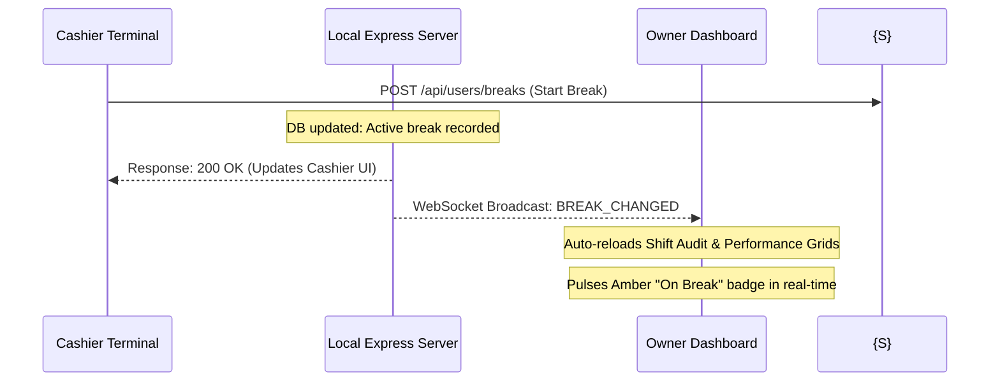
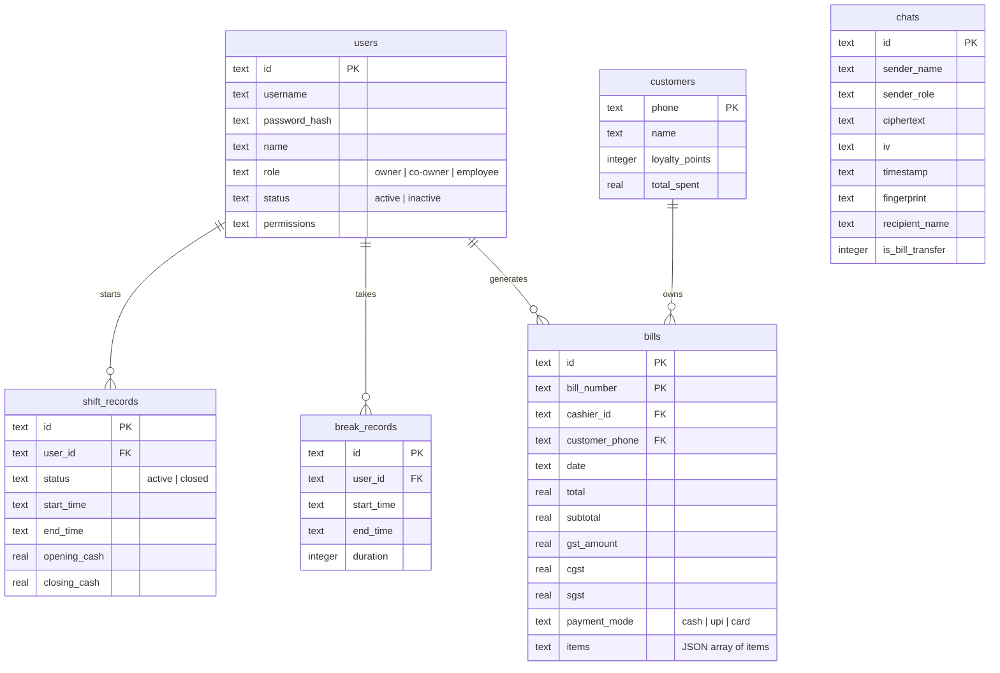

# NexusFlow — Advanced LAN-Based Retail Billing System

NexusFlow is a state-of-the-art, high-performance retail billing, inventory management, and store operations application designed specifically for local area networks (LAN). It provides store cashiers with a fluid, keyboard-driven checkout interface, incorporates enterprise-grade security protocols, and offers owners complete, real-time administrative control over inventory, tax reports, employee performance, AI forecasting, and multi-device registers.

---

## 🏗️ Complete System Architecture

NexusFlow operates on a highly optimized local client-server framework. It does not rely on an external internet connection, making it completely immune to cloud outages and extremely fast for high-traffic checkout lines.

```mermaid
graph TD
    subgraph LAN Register Terminal [Cashier Terminal (Vite + React Client)]
        UI[Glassmorphic React UI]
        State[React Context / State]
        WS_Client[WebSocket Hook Client]
        Crypto[SubtleCrypto AES-GCM Encryptor]
        UI --> State
        State --> Crypto
    end

    subgraph Native Android Wrapper [NexusFlow Android App (Kotlin WebView)]
        Immersive[Immersive Fullscreen Lock]
        CamBridge[WebChromeClient Camera Permission Bridge]
        IpCache[LAN Server IP SharedPreferences Cache]
        Immersive --> UI
        CamBridge --> UI
    end

    subgraph Local LAN Server [Host Machine (Express.js + TypeScript)]
        Express[Express REST API]
        WS_Server[WebSocket Server Router]
        DB[(SQLite DB - WAL Mode)]
        Daemon[Background Archiver & Retention Daemon]
        Sweeper[Active Session Heartbeat Sweeper]
        
        Express --> DB
        WS_Server --> Express
        Daemon --> DB
        Sweeper --> DB
    end

    State -- REST API Requests --> Express
    WS_Client -- Real-Time Subscriptions --> WS_Server
    WS_Server -- Push Notifications --> WS_Client
```

### The Technology Stack
*   **Frontend Client**: React (Vite-powered Single Page Application) with Tailwind CSS for glassmorphic styling, Lucide React for modern icons, and HTML5 Canvas + Physics Engines for background ambient animations.
*   **Native Mobile/Tablet App**: Native Kotlin Android Wrapper featuring Immersive Sticky Locks, SharedPreferences IP storage, and custom `WebChromeClient` permissions hooks.
*   **Backend LAN Server**: Node.js & Express.js written in TypeScript, acting as the local host.
*   **Database Layer**: SQLite database configured in Write-Ahead Logging (WAL) mode for maximum concurrency and high-speed write performance across multiple terminals.
*   **Real-time Synchronization**: Lightweight custom WebSocket (WS) layer that propagates system events across all registers instantaneously.
*   **Cryptographic Core**: Web Crypto API (`window.crypto.subtle`) for client-side hardware-accelerated E2EE encryption/decryption routines.

---

## 💎 Advanced Key Features

### 1. 🔒 Client-Side End-to-End Encrypted (E2EE) Chat & Cart Sharing
*   **Hardware-Grade AES-256-GCM Encryption**: Text messages and cooperative bill transfers are encrypted locally in the cashier's browser using `SubtleCrypto` before being transmitted over the LAN. The server remains a blind cryptographic relay, storing and broadcasting *only* secure base64 ciphertext envelopes.
*   **Passphrase Key Derivation**: Keys are derived locally via SHA-256 with an inline hex fingerprint (e.g., `E8-2F-9A-0D`) so registers can quickly align store keys.
*   **Cooperative Bill Transfers**: Cashiers can package active draft carts (items, discounts, customer names) with one click, E2EE encrypt them, and broadcast them over the chat. Other cashiers sharing the passphrase see an interactive **Accept Bill** card that instantly hydrates their checkout cart.
*   **Parser Resilience**: Incorporates a recursive unescaper to handle escaped JSON WebSocket frames up to 5 levels deep, ensuring zero-fault card rendering.

### 2. 🔄 Concurrency Control, 30s Heartbeats & Sudden Crash Sweepers
*   **Single-Session Enforcement**: To ensure employee accountability, a cashier can only maintain a **single active login session** on the LAN. Logging into a new register instantly kicks out any older sessions via a `SESSION_INVALIDATED` WebSocket event.
*   **30s Keep-Alive Heartbeat**: Frontend terminals periodically ping `/api/auth/heartbeat` when `currentSession` is active. Sudden tab closes or power failures are caught using background keep-alive fetches on window unload.
*   **Active Session Sweeper (`cleanupStaleSessions`)**: Runs on server boot and every 60 seconds on the server. Stale sessions (no heartbeat for >2 minutes) are automatically closed and their exact logout time is written back to the database matching their last known active timestamp to preserve 100% correct shift durations.

### 3. 📅 Color-Coded Registration-Aware Attendance Calendar
*   **Colored Status Schemes**: Overhauled monthly grid in layout shell to color-code attendance statuses: **Blue** (Present), **Red** (Absent), **Orange** (Leave), and **Green** (Holiday) with visual badge indicators.
*   **Hiring Registration Date Boundaries**: Restricted the `Absent` status to past days *on or after* the employee's account registration date (`created_at`), preventing false absence marks on historical calendar days prior to hiring.
*   **Legend & Owner Filter**: Mounted an intuitive status legend and a dropdown filter so owners can audit any specific cashier's monthly grid separately.

### 4. 📈 AI Predictive Sales Forecasting & Dashboard Panel
*   **Linear Regression Engine**: Built a mathematical engine using simple linear regression ($y = mx + c$) on daily sales data to project upcoming 7-day outward revenue metrics.
*   **Dashed Recharts Linkage**: Plotted actual sales area with projected dashed lines in Recharts, complete with interactive toggles and sliding details panels.
*   **AI Insights Side-Panel**: Developed a sliding details panel providing projected 7-day total revenue figures, a trend trajectory delta index (+/- revenue per day), and statistical $R^2$ accuracy confidence scores.

### 5. 🧾 Outward Supplies GSTR-1 Tax Exporter
*   **GST GSTR-1 Report**: Added a fully functional GSTR-1 Report tab in the analytics dashboard that aggregates sales from SQLite bills JSON data on-the-fly.
*   **B2B CSV Export**: Groups transactions by HSN and tax slabs (e.g. 0%, 5%, 12%, 18%) into CGST and SGST outputs, with compliant GSTR-1 outward CSV spreadsheet downloads.

### 6. 📦 Restock Purchase Order (PO) Procurement Generator
*   **Interactive Restock PO**: Mounted a Restock PO Generator tab in System Settings sidebar that automatically flags low-stock catalog items.
*   **Supplier Configurations & Exports**: Pre-fills order quantities based on threshold targets, sets procurement rates (defaulting to 30% margin), supports customized supplier setups, and generates printable purchase order CSVs.

### 7. 💵 Shift Closing Tally & Physical Denominations Calculator
*   **Collapsible Denomination Tally Panel**: Mounted a collapsible grid panel inside the Shift Closing counts section that standardizes closing balances.
*   **INR Denominations Support**: Created tally fields for all standard INR bills and coins (₹2000, ₹500, ₹200, ₹100, ₹50, ₹20, ₹10, ₹5, ₹2, ₹1).
*   **Manual Input Safety Lock Guard**: Enabled automatic synchronization between the calculator total and the `actualCash` input field, dynamically locking the text box when the calculator is active to enforce strict audit integrity.

### 8. ⭐ Spend-Based Loyalty Tiers & Checkout Gamification
*   **Spend-Based Tiers**: Categorizes customers based on total spend instead of points balances, resolving reset flaws: **Bronze** (< ₹5k; 1.0x), **Silver** (₹5k - ₹15k; 1.2x), **Gold** (₹15k - ₹40k; 1.5x), and **Platinum** (> ₹40k; 2.0x).
*   **Checkout Multipliers**: Points earned during checkout are scaled automatically using the customer's current spend-based tier multiplier.
*   **Gamified Progress Bar**: Revamped the cashier customer card UI to render dual balances (point balances in high-contrast purple, total lifetime spent in rich emerald) and a visual progress slider bar themed with individual gradient styling showing the exact progress towards the next limit (e.g. `₹3,400 / ₹5,000 to Silver Tier`).

### 9. 📱 Mobile-First Scan Billing & Attendance Rules
*   **Streamlined Mobile Register View**: Accessing the POS on mobile viewports (< 768px) bypasses desktop grids in favor of simple item lists, a quick-add drop-down, and a clear attendance check-in status card.
*   **Mobile Login Attendance Exemptions**: Cashiers logging in on a mobile app do **not** get automatically marked as present or start their shift (preventing clocking in from home!). A shift is only opened and their attendance validated **once they complete their first checkout bill transaction**.
*   **Live HTML5 Barcode Camera Scanner**: Features a rear-camera HTML5 stream using media devices (`getUserMedia`) in a scanning overlay with a red sweeping laser line. Decodes barcodes automatically via the native `BarcodeDetector` API, and includes a quick demo scan simulator.

### 10. 🤖 Native Android Tablet POS Application Wrapper
*   **Fullscreen Immersive Sticky Mode**: Auto-hides standard Android navigation bars and system status menus. Cashiers remain locked inside the POS billing terminal.
*   **Dynamic LAN Server IP Dialog**: On first launch, the app displays a Material-themed dialog asking for the local IP address of your POS Host Server. Once entered, it automatically caches the IP in Android `SharedPreferences` and connects.
*   **Camera Permission Bridge**: Integrates a custom `WebChromeClient` inside `MainActivity.kt` that intercepts web-page camera queries (`getUserMedia`) and bridges them directly to Android Runtime OS permissions, allowing camera scanning natively.

### 11. ⚖️ GST-Compliant Individual Product Discounts
*   **Dual Price-Discount Synchronization**: Added interactive, real-time discount percentage controls directly to cart items on both Desktop (column-aligned input cells) and Mobile (badge inputs). Changing a discount computes the active price, and changing a price reverse-calculates the discount.
*   **Compliant Taxable Value Computations**: Calculates regional GST taxes (CGST and SGST) directly on the discounted value of each product, ensuring 100% accurate regional tax and GSTR-1 audit trails.

### 12. 📹 Full HD Continuous Autofocus Mobile Scanner
*   **Continuous Focus Mode**: Overhauled both settings and checkout mobile scanners to dynamically check media track capabilities (`track.getCapabilities()`). If continuous focus is supported, it is requested and applied programmatically, eliminating blurry barcodes.
*   **1080p Stream Constraint**: Expanded viewport constraints to ideal `1920x1080` (Full HD) resolution, offering rich image density for small barcode labels.

### 13. 📦 Indian Retail/Wholesale UOM & HSN Rule Exemptions
*   **Optional HSN Codes**: Relaxed constraints across product validation schemas and front-end forms to make HSN code entry optional, fully supporting non-taxable or small local retail products.
*   **Custom UOM Entry**: Implemented a dynamic Unit of Measurement selector in catalog forms that lets owners create and save custom measurements (e.g. `PAIR`, `BOTTLE`, `TIN`) on-the-fly.

### 14. 💾 High-Performance CSV Database Exporters
*   **Blob-based Downloads**: Migrated settings customer, product, employee, and administrator (owners/co-owners) database spreadsheet exporters to use the modern HTML5 `Blob` and `URL.createObjectURL` API. This completely avoids URL length restrictions and special character crashes during heavy multi-thousand row dumps.
*   **Leak-Proof Administrator Audits**: Built strict privacy filtering inside the Admin DB exporter to automatically clean and filter out the seed developer account credentials (`dev_1`/`developer`/`developer@retailpos.com`) preventing intellectual property leakages to store managers.
*   **Contextual Access Buttons**: Plotted a beautifully structured four-column download panel inside the data management settings tab, alongside a dedicated, quick "Export CSV" button on the Employee Management page header.

### 15. 👻 Zero-Trace Developer Ghost Mode & WebSocket Invisibility
*   **Total Administrative Privacy**: The permanent seed developer account (`dev_1` / `developer` / `developer@retailpos.com`) is completely omitted from all database subqueries (`GET /api/users`), making it completely invisible in settings pages, employee lists, or co-owner management interfaces.
*   **Active WebSocket Cloaking**: The server handles the developer's client WebSocket socket silently. When the developer logs in, they are registered to receive LAN updates, but they are excluded from the `ACTIVE_USERS_LIST` broadcast. No active user counts, connection badges, or presence lights are broadcasted to other terminal screens.
*   **Suppressed State Broadcasts**: Broadcaster guards intercept and silence WebSocket messages (`SESSION_CHANGED`, `SESSION_INVALIDATED`, `BREAK_CHANGED`, `SHIFT_CHANGED`, `BILL_CREATED`, `LEAVES_UPDATED`) for any activities triggered under the developer identity.
*   **Leak-Proof Logs**: Chat archives, breaks, shifts, leaves, and transaction logs associated with the developer are completely filtered out in query endpoints, ensuring a completely clean, zero-trace ghost presence across all cashier and owner analytical interfaces.

---

## 🕸️ Real-Time LAN Synchronization Framework

To synchronize registers on a local network without cloud overhead, NexusFlow utilizes an event-driven WebSocket broadcast protocol. When a cashier or owner makes a change on one terminal, the server instantly pushes specific events to all other terminals:



### Registered System Events:
1.  `STOCK_UPDATED`: Sent when inventory details or stock levels change, auto-updating checkout registers.
2.  `BREAK_CHANGED`: Broadcast when an employee starts/ends a break, updating shift monitors.
3.  `SHIFT_CHANGED`: Broadcast on shift start/closing, updating register session lists.
4.  `SESSION_CHANGED`: Broadcast on login/logout, keeping cashier logs synced.
5.  `SALES_CHANGED`: Broadcast on billing completion, updating analytics charts in real-time.
6.  `SESSION_INVALIDATED`: Sent to a specific WebSocket client to force-logout an older concurrent session.

---

## 🗃️ Complete Relational Database Schema

The SQLite database (`store.db`) utilizes five clean relational schemas with index lookups for fast retrieval:



---

## 🛠️ Developer Setup & Directory Framework

If you are a developer extending the NexusFlow system, here is the core structural directory layout:

```text
├── index.html                  # Main SPA HTML5 anchor
├── package.json                # Project dependencies and startup scripts
├── vite.config.ts              # Vite asset bundles config
├── server/                     # LAN EXPRESS BACKEND
│   ├── index.ts                # HTTP & WebSocket initialization
│   ├── db.ts                   # SQLite connections and migrations
│   ├── middleware/
│   │   └── auth.ts             # Auth middleware & DB session validation
│   └── routes/                 # REST API Controller Endpoints
│       ├── auth.ts             # Cashier session routes
│       ├── chats.ts            # E2EE chat history routes
│       ├── products.ts         # Inventory CRUD routes
│       ├── shifts.ts           # Z-Reports and shift subqueries
│       └── users.ts            # cashiers and break routes
├── android app/                # NATIVE KOTLIN ANDROID CONTAINER
│   ├── build.gradle            # Root buildscript
│   ├── settings.gradle         # Root configuration
│   └── app/
│       ├── build.gradle        # App dependencies & SDK targets
│       └── src/main/
│           ├── AndroidManifest.xml # Permissions & tablet support map
│           ├── java/com/nexusflow/pos/MainActivity.kt # Immersive WebView launcher
│           └── res/layout/activity_main.xml # Fullscreen WebView Layout
└── src/                        # CLIENT REACT FRONTEND
    ├── main.tsx                # App bootstrap entry
    └── app/
        ├── routes.ts           # React Router declarations
        ├── contexts/           # Auth and Theme provider hooks
        ├── hooks/              # useWebSocket LAN syncing hooks
        └── components/         # CORE UI MODULES
            ├── layout.tsx      # Global dashboard shell & navigation
            ├── login-page.tsx  # Authentication view with 3D tilting card
            ├── pos-settings.tsx# Shift auditing and Product Inventory CRUD
            ├── cashier-billing-advanced.tsx # Real-time Checkout sheet
            └── ui/             # REUSABLE UI ELEMENTS
                ├── e2ee-chatbox.tsx # AES-256 E2EE chat widget
                └── interactive-mesh-background.tsx # Canvas animations
```

### Installation
1.  Install dependencies:
    ```bash
    pnpm install
    ```
2.  Start the development environment (both backend Express server and Vite frontend client):
    ```bash
    pnpm dev
    ```
3.  Compile for production release:
    ```bash
    pnpm build
    ```
4.  Run production server:
    ```bash
    pnpm start
    ```